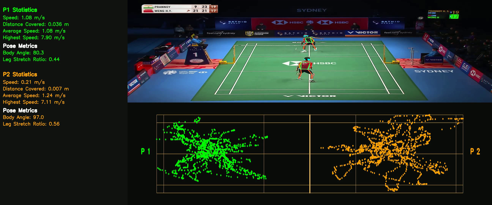
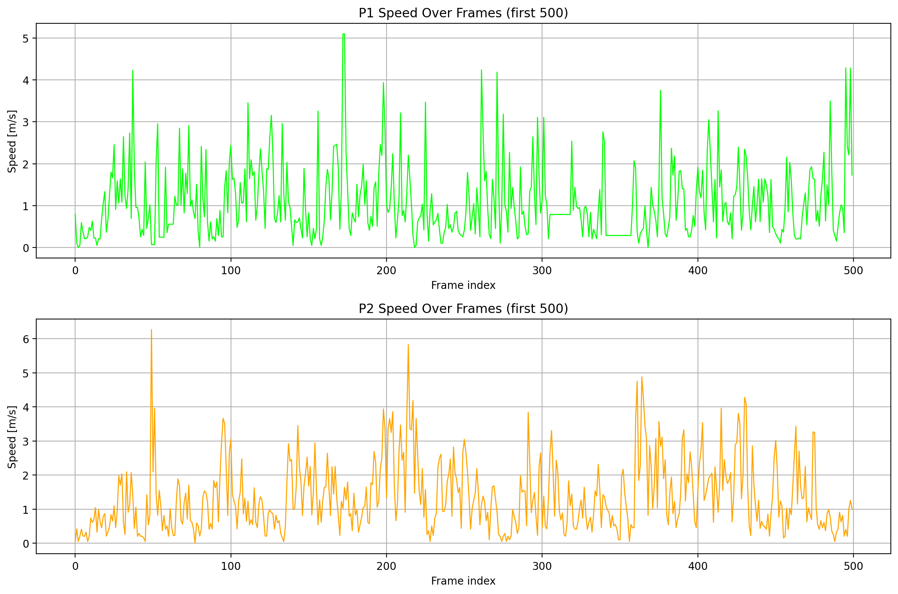
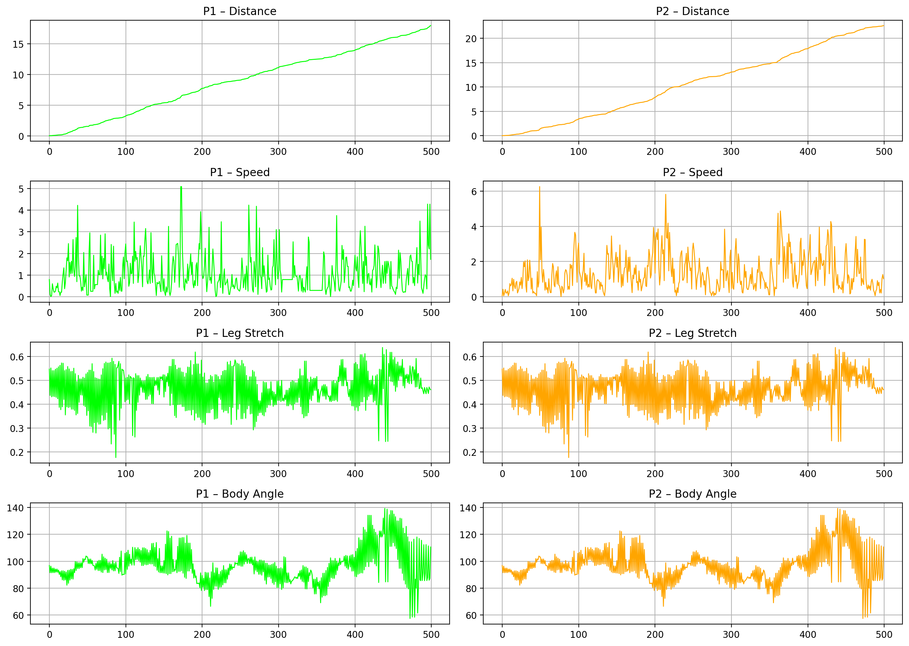

# 🏸 Badminton Player Movement Analytics



A complete **computer vision–driven sports analytics project** that extracts, analyzes, and visualizes badminton player movement to generate **coach‑interpretable tactical insights**.

This repository demonstrates how raw video and trajectory data can be transformed into **advanced spatial analytics**, similar to methods used in professional sports performance analysis.

---

## 📌 Project Overview

Modern sports analytics goes beyond statistics, it focuses on **space, movement, and decision‑making**.\
This project analyzes badminton player positioning using trajectory data derived from match footage, pose estimation and shuttle detection.

The goal is to answer questions such as:

- Who controls which areas of the court?
- How do players transition between attack and defense?
- Where does physical pressure peak?
- How disciplined is a player’s positioning?

All insights are derived **purely from movement trajectories**, making the approach scalable and camera‑agnostic.

---

## 🎯 Objectives

- Extract player movement trajectories from video
- Normalize movements to a consistent court reference frame
- Quantify spatial dominance and court usage
- Compare players using interpretable visual analytics
- Present results in a **portfolio‑ready, research‑grade format**
- Detects the shuttlecock using a custom-trained YOLO11 model

The pipeline is modular and extensible, enabling future shot-type classification and rally-level analysis.

## 🎥 Demo

Below is a short preview of the annotated badminton analytics output.

<div align="center">
  <a href="https://drive.google.com/file/d/1eHXk_JpB62gfHbw5AfBkhl1Yojlu7zTF/view?usp=sharing" target="_blank">
    
    
  </a>
</div>


---

## 📂 Repository Structure

```
Badminton_Analytics_Project/
│
├── datasets/
│   └── Shuttlecock.v1i.yolov11/
│   	 ├── test/
│   	 │	└── ....
│   	 ├── train/
│   	 │	└── ....
│   	 ├── valid/
│   	 │	└── ....
│   	 ├── data.yaml
│   	 ├── README.dataset.txt
│   	 └── README.roboflow.txt   
├── logs/
│
├── notebooks/
│   └── Badminton Analysis.ipynb
│
├── Results/
│   ├── RECOVERY POSITION (MEAN + DISPERSION)_20260105_115146_255325.png
│   ├── Player Trajectories Over Court_20260105_113759_732482.png
│   ├── players_speed_over_time.png
│   └── .......
│
├── Runs/
│
├── videos/
│   ├── Video Project 2.mp4
│   └── Video Project.mp4
│
├── weights/
│   ├── best.pt
│   └── last.pt
│
├── README.md
├── requirements.txt
└── .gitignore
```

---

## 🛠 Technologies Used

- **Python**
- **OpenCV** – video processing
- **YOLOv8** – player detection
- **YOLOv8 Pose Estimation** – player joint detection
- **YOLO11 Object Detection** – shuttlecock detection (custom trained)
- **NumPy / Pandas** – data processing
- **Matplotlib** – scientific visualization
- **MoviePy** – video/audio handling
	

---

## 🔬 Methodology

### 1️⃣ Player Tracking & Trajectory Extraction

- Players are detected using YOLOv8 pose estimation
- The body center (or ankle midpoint) is used as the player position
- Trajectories are stored as `(x, y, time)` sequences

### 2️⃣ Court Normalization

- Raw coordinates are normalized to a **canonical court reference frame**
- This allows fair comparison across frames, rallies, and players

### 3️⃣ Spatial Analytics

- The court is divided into logical zones (Front/Mid/Back × Left/Right)
- Movement density, transitions, and dominance are computed

### 4️⃣ Shuttlecock Detection & Shot-Type Context (YOLO11)

- A YOLO11 object detection model is custom-trained to detect the shuttlecock
-Training data is sourced from an open-source Roboflow dataset

- Shuttle trajectories provide:

	- Temporal shot context

	- Spatial shot location

	-Player–shuttle interaction alignment

This enables shot-type analysis (e.g., smash, drop, clear) by combining:

- Shuttle movement patterns

- Player position and movement dynamics

---

## 📊 Visual Analytics & Insights

### 1️⃣ Court Dominance Difference Map

**What it shows:**

- Relative spatial dominance between Player 1 and Player 2
- Positive regions indicate Player 1 control
- Negative regions indicate Player 2 control

<p align="center">
  
</p>


**Insight:** Reveals tactical pressure zones and positional advantages.

---

### 2️⃣ Court Coverage – Convex Hull

**What it shows:**

- The total area of the court covered by each player
- Movement discipline vs roaming behavior

<p align="center">
  
</p>


**Insight:** Players with smaller hulls often exhibit better positional discipline.

---

### 3️⃣ Zone Transition Matrix

**What it shows:**

- Probabilities of moving between court zones
- Attack ↔ defense transitions

<p align="center">
  
</p>


**Insight:** Highlights play style (aggressive vs defensive) and recovery behavior.

---

### 4️⃣ Speed‑Weighted Court Map

**What it shows:**

- Average movement speed per court location
- High‑intensity zones where explosive movement occurs

<p align="center">
  
</p>

**Insight:** Identifies physically demanding regions of play.

---

### 5️⃣ Recovery / Mean Position

**What it shows:**

- Average positioning over the entire rally
- Tactical reset tendencies

<p align="center">
  
</p>


**Insight:** Elite players tend to recover closer to optimal central positions.

**Other Insights**

**Player Trajectories Over Court**

<p align="center">
  
</p>

**Player Movement Heatmap**

<p align="center">
  
</p>

**Players Speed over Time**

<p align="center">
  
</p>

**Speed over Frame**

<p align="center">
  
</p>

**validation_metrics**

<p align="center">
  
</p>


---

## 🧠 Key Insights Enabled

- Spatial dominance comparison between players
- Identification of defensive vs offensive tendencies
- Court usage efficiency and discipline
- Physical load distribution across the court
- Movement strategy characterization

---

## 📈 Applications

- **Performance analysis for coaches**
- **Player scouting & comparison**
- **Sports science & biomechanics research**
- **Computer vision portfolio projects**
- **Movement behavior modeling**

---

## 🚀 Future Work

- Shuttle tracking and shot‑based analysis
- Rally‑level segmentation
- Injury risk indicators from asymmetry
- Time‑resolved fatigue analysis
- Interactive dashboard (Plotly / Streamlit)

---

## ▶️ How to Run


Open the notebook:

```bash
colab notebook notebooks/Badminton_Analysis.ipynb
```

---

## 👤 Author

**Muhammad Yasin**\
Data Analytics | Computer Vision | Sports Analytics

📫 LinkedIn: [https://www.linkedin.com/in/YOURNAME](https://www.linkedin.com/in/muhammad-yasin-ds)\
💻 GitHub: [https://github.com/YOURUSERNAME](https://github.com/muhammadyasin79)

---

## ⭐ Datasets & Acknowledgements

**Shuttlecock Detection Dataset**

@misc{shuttlecock-cqzy3_dataset,
  title        = {Shuttlecock Dataset},
  author       = {Mathieu Cartron},
  howpublished = {https://universe.roboflow.com/mathieu-cartron/shuttlecock-cqzy3},
  year         = {2022},
  month        = {March},
  note         = {Accessed: 2026-01-05}
}

- Used for custom training of YOLO11 shuttlecock detection model

- Enables shot-type and rally-context analysis

**Tools**

- Ultralytics YOLOv8
- Open‑source computer vision community

---

If you find this project useful, feel free to ⭐ the repository or reach out for collaboration.

